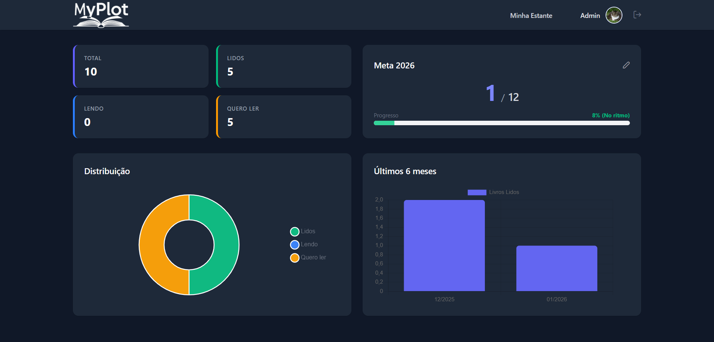
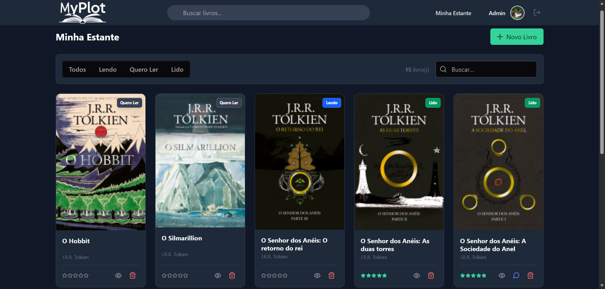
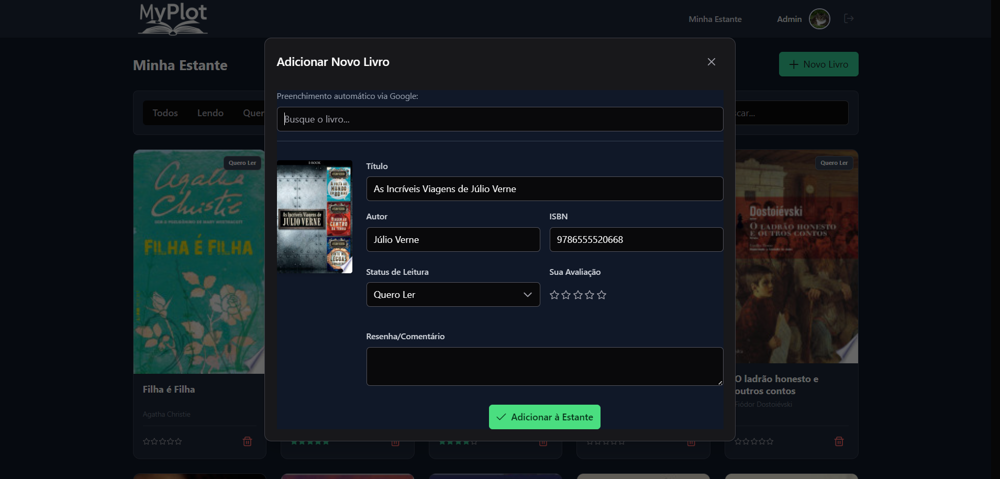

# My Plot


**My Plot** é a sua estante virtual pessoal. Uma aplicação web moderna para organizar leituras, rastrear o progresso de livros e definir metas anuais, integrando-se diretamente à API do Google Books para facilitar a descoberta de novos títulos.

---

## Funcionalidades

-   **Gestão de Estante:** Adicione livros e categorize-os por status: *Lendo*, *Quero Ler* ou *Lido*.
-   **Integração Google Books:** Busque e adicione livros automaticamente (capa, autor, páginas, sinopse) sem digitação manual.
-   **Dashboard Interativo:** Visualize estatísticas de leitura, progresso anual e livros recentes.
-   **Metas de Leitura:** Defina e acompanhe sua meta de livros para o ano.
-   **Avaliações e Resenhas:** Dê notas (1-5 estrelas) e escreva resenhas pessoais para cada livro.
-   **Interface Moderna:** Design responsivo e elegante com **Dark Mode** automático.
-   **Autenticação Segura:** Sistema completo de login e registro via Laravel Sanctum.

---

## Tecnologias Utilizadas

### Backend
-   **Laravel 11:** Framework PHP robusto para API RESTful.
-   **MySQL:** Banco de dados relacional.
-   **Laravel Sanctum:** Autenticação via Tokens.
-   **Services Pattern:** Lógica de negócio isolada (ex: `GoogleBooksService`).

### Frontend
-   **Vue.js 3 (Composition API):** Reatividade e componentes modulares.
-   **Vite:** Build tool ultrarrápido.
-   **Tailwind CSS:** Estilização utility-first.
-   **PrimeVue:** Biblioteca de componentes UI ricos (Modais, Tabelas, Toasts).
-   **Axios:** Cliente HTTP para comunicação com a API.

### Infraestrutura
-   **Docker & Docker Compose:** Ambiente de desenvolvimento containerizado.
-   **Cloudinary:** Armazenamento otimizado de imagens (Avatares/Capas).

---

## Screenshots

<div align="center">
  
  <p><em>Visão geral do progresso e metas de leitura</em></p>
  
  <br>

  <div style="display: flex; justify-content: center; gap: 20px;">
    
    
  </div>
  <p><em>Gerenciamento da Estante e Integração com Google Books</em></p>
</div>

---

## Como Rodar o Projeto

### Pré-requisitos
-   [Docker](https://www.docker.com/) e Docker Compose instalados.
-   OU PHP 8.2+, Composer e Node.js instalados localmente.

### Opção 1: Com Docker (Recomendado)

1.  **Clone o repositório:**
    ```bash
    git clone [https://github.com/raissabdias/my-plot.git](https://github.com/raissabdias/my-plot.git)
    cd my-plot
    ```

2.  **Configure o ambiente:**
    ```bash
    cp .env.example .env
    ```
    *Edite o arquivo `.env` e configure suas credenciais de banco de dados (se necessário) e a chave da API do Google.*

3.  **Suba os containers:**
    ```bash
    docker compose up -d
    ```

4.  **Instale as dependências e rode as migrações:**
    ```bash
    docker compose exec app composer install
    docker compose exec app php artisan key:generate
    docker compose exec app php artisan migrate --seed
    docker compose exec app npm install
    docker compose exec app npm run dev
    ```

5.  **Acesse:**
    O projeto estará rodando em `http://localhost:8000`.

### Opção 2: Manualmente (Sem Docker)

1.  Instale as dependências de Backend: `composer install`
2.  Configure o `.env` com seu banco de dados local.
3.  Gere a chave: `php artisan key:generate`
4.  Rode as migrações: `php artisan migrate`
5.  Instale as dependências de Frontend: `npm install`
6.  Inicie os servidores:
    -   Terminal 1: `php artisan serve`
    -   Terminal 2: `npm run dev`

---

## Variáveis de Ambiente Importantes

Para que todas as funcionalidades funcionem, certifique-se de preencher estas chaves no seu `.env`:

```ini
# Conexão com Banco de Dados
DB_CONNECTION=mysql
DB_HOST=mysql # ou 127.0.0.1 se rodar local
DB_PORT=3306
DB_DATABASE=myplot
DB_USERNAME=seu_usuario
DB_PASSWORD=sua_senha

# Integrações
GOOGLE_BOOKS_API_KEY=sua_chave_aqui
CLOUDINARY_URL=sua_url_cloudinary # Opcional, para upload de imagens